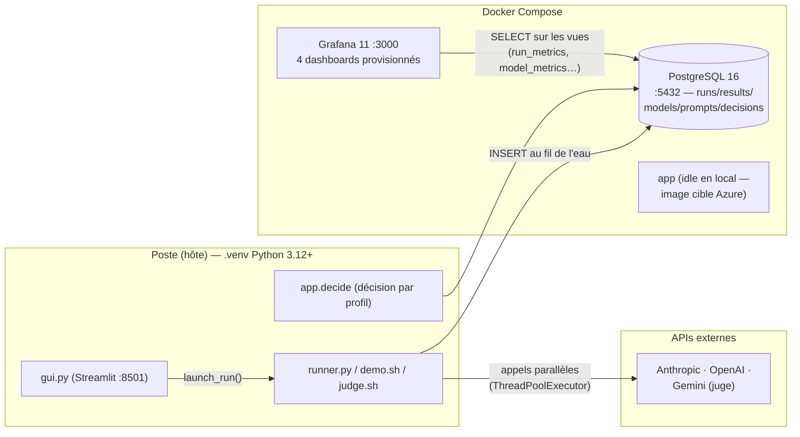

# RUNBOOK — LLM-Comparison

> **Référence Jira :** SCRUM-33 · **Public :** développeur/opérateur de la plateforme
> Guide opérationnel : démarrer, exploiter, déboguer et comprendre les coûts.
> Pour la conception complète (composants, modèle de données, traçabilité
> backlog), voir [docs/ARCHITECTURE.md](docs/ARCHITECTURE.md).

---

## 1. Vue d'ensemble de l'architecture

La plateforme évalue plusieurs LLM (Claude, OpenAI, Gemini) sur les
mêmes prompts, mesure **qualité** (juge LLM Gemini, score 0–5), **latence**,
**tokens** et **coût**, persiste chaque réponse dans PostgreSQL et bloque les
régressions en CI.

Point structurant à comprendre avant de déboguer : **le code d'évaluation
tourne sur l'hôte** (ton poste, dans `.venv`) ; Docker ne fournit que les
services d'infrastructure (Postgres, Grafana). Le conteneur `app` est dormant
en local — c'est l'image destinée au cloud.



Le flux d'un run : sélection (GUI ou CLI) → fan-out parallèle des appels API →
chaque réponse persistée immédiatement dans `results` (latence, tokens, coût,
score juge) → Grafana lit les vues SQL à l'affichage. GUI et Grafana ne se
parlent jamais directement — Postgres est la seule source de vérité.

Réseau : dans Docker, les conteneurs se joignent par nom de service
(`postgres:5432` — ce que Grafana utilise). Depuis l'hôte, on passe par le
port publié (`localhost:5432`) — c'est pourquoi `gui.sh`/`demo.sh`/`judge.sh`
réécrivent `DATABASE_URL` de `@postgres:` vers `@localhost:`.

---

## 2. Déployer

### 2.1 Local (environnement de référence)

Prérequis : Docker Desktop, Python 3.12+, un fichier `.env` (copier
`.env.example`, remplir `ANTHROPIC_API_KEY`, `OPENAI_API_KEY`,
`GEMINI_API_KEY` — **jamais commité**).

```bash
docker compose up -d                 # Postgres + Grafana + app
python3 -m venv .venv && source .venv/bin/activate
pip install -r requirements-gui.txt  # inclut app/requirements.txt
python -m app.prompts.cli sync       # prompts versionnés YAML → base
bash demo.sh                         # run de validation (~10-15 s)
```

Le schéma et les migrations (`db/schema.sql` puis `db/0*.sql`) sont appliqués
automatiquement au premier démarrage du conteneur Postgres ; les données
persistent dans le volume `pgdata` entre les redémarrages.

### 2.2 CI (GitHub Actions — sur chaque PR vers `main`)

Deux jobs (`.github/workflows/ci.yml`) :
1. **lint-and-test** (hors-ligne) : `ruff check` + `pytest --cov-fail-under=70`
   — SDK LLM et psycopg mockés, aucun secret requis.
2. **eval-gate** : Postgres 16 de service → schéma + migrations + seed → sync
   prompts → **éval réelle mais minimale** avec juge Gemini et
   `--fail-under 3.5`. Clés injectées depuis GitHub Secrets. Sort en code 5
   (`EXIT_REGRESSION`) si un modèle passe sous 3,5/5.

### 2.3 Production (cible — non déployée)

Architecture cible : Azure Container Apps (image `app/Dockerfile`) + PostgreSQL
Flexible Server + Azure Monitor (les logs JSON sur stdout y sont capturés
nativement). IaC en Bicep dans `infra/`. Statut : conçu (SCRUM-27/28),
volontairement reporté après la présentation — le local est l'environnement
de référence.

---

## 3. Exploiter (opérations courantes)

```bash
# Run depuis le navigateur (modèles + dataset + juge + samples)
bash gui.sh                                    # → http://localhost:8501

# Run en CLI — reproductible, scriptable
python runner.py --dataset evaluator/datasets/demo_v1.yaml \
                 --models claude-sonnet-5 gpt-5.4-nano --samples 3 --judge

# Run jugé en une ligne (dataset smoke par défaut)
bash judge.sh claude-sonnet-4-6 gpt-5

# Décision finale par profil d'usage (SCRUM-38)
# Automatique après chaque run jugé (--judge), tous profils ; --no-decide
# côté runner pour sauter. La CLI reste pour re-décider un ancien run :
python -m app.decide --all-profiles            # ou --profile etudiant, --force

# Nettoyer les runs de test (backup automatique AVANT toute suppression)
bash scripts/reset_db.sh --today               # runs du jour
bash scripts/reset_db.sh --run 42              # un run précis
bash scripts/reset_db.sh --all                 # base vierge (garde models/prompts)

# Restaurer un état connu (ex. le snapshot doré de démo)
docker compose exec -T postgres psql -U llm -d llm_eval \
  < eval_backups/llm_eval_golden_20260707.sql
```

Dashboards Grafana (http://localhost:3000, provisionnés par fichiers —
versionnés dans `dashboard/`) : `llm_model_comparison`, `llm_final_decision`,
`llm_quality_triage`, `llm_style_benchmark`.

---

## 4. Déboguer

### 4.1 Où regarder

- **Logs applicatifs** : JSON structuré, une ligne par événement, sur stdout
  (`timestamp`, `level`, `model`, `run_id` ; stack trace sous `exception`).
  Jamais de clé API ni de contenu de prompt dans les logs (règle B13).
- **Logs services** : `docker compose logs -f postgres` (ou `grafana`).
- **Base** : `docker compose exec postgres psql -U llm -d llm_eval` puis
  interroger `runs`, `results`, ou les vues (`run_metrics`, `result_review`…).
- **Codes de sortie du runner** : `0` OK · `1` erreur de config (env, base,
  prompt système absent) · `2` mauvais arguments CLI · `3` échec partiel (au
  moins un appel a levé) · `5` régression (`--fail-under` déclenché, prime
  sur 3).

### 4.2 Pannes fréquentes

| Symptôme | Cause probable | Remède |
|---|---|---|
| `.env missing` au lancement d'un script | `.env` absent | `cp .env.example .env` + remplir les clés |
| `Postgres not healthy` / connexion refusée | Services arrêtés | `docker compose up -d postgres` puis attendre le healthcheck |
| `ModelNotFoundError` | Modèle dans `MODEL_REGISTRY` mais pas dans la table `models` | Appliquer la migration seed (`db/018_*.sql`) ou vérifier `db/seed.sql` |
| `System prompt not found` | Prompts jamais synchronisés | `python -m app.prompts.cli sync` |
| HTTP 400 `temperature unsupported` | Modèle de raisonnement avec `supports_temperature=True` dans le registre | Mettre le flag à `False` (cf. `claude-opus-4-8`) |
| Réponse vide, score juge ~0 | Budget tokens mangé par le raisonnement | `DEFAULT_MAX_TOKENS` (8192) volontairement haut — ne pas le baisser |
| HTTP 529 `overloaded` en rafale | Pool Anthropic en surcharge | Déjà amorti (`max_retries=8`, back-off exponentiel) — laisser tourner |
| `judge_score` NULL sur quelques lignes | Échec ponctuel du juge (quota, JSON mal formé) | Comportement voulu (best-effort) : journalisé, le run continue |
| Port 8501/3000/5432 occupé | Autre instance/service | `lsof -i :8501` puis tuer le processus, ou changer le port |
| Écran « Welcome to Streamlit » qui bloque | Onboarding premier lancement | `printf '[general]\nemail = ""\n' > ~/.streamlit/credentials.toml` |
| Dashboards « pollués » par des runs d'essai | Données de test en base | `bash scripts/reset_db.sh --today` (les dashboards ne stockent rien) |
| Dashboard « LLM Final Decision » vide | Run non jugé, ou juge en échec total (auto-decide sauté) | Relancer avec `--judge`, ou `python -m app.decide --run N` sur un run déjà jugé |
| Comparaison vide malgré des résultats en base | Aucun cas complet (un modèle a échoué partout → filtre cas-complets, migration 022) | `SELECT * FROM complete_cases WHERE run_id = N;` pour diagnostiquer ; relancer le modèle en échec |

### 4.3 Sauvegarde / restauration

`scripts/reset_db.sh` fait un `pg_dump --clean --if-exists` horodaté dans
`eval_backups/` **avant chaque suppression** ; la commande de restauration est
affichée en fin d'exécution. Un dump se restaure par-dessus la base existante
(les `DROP` sont inclus). Bonne pratique avant une démo : figer un « état
doré » (`pg_dump` manuel) et le tester dans une base jetable (`createdb
llm_eval_verify` → restore → vérifier les comptes → `dropdb`).

---

## 5. Coûts

### 5.1 Chiffres réels observés (base au 2026-07-07)

| Run | Dataset | Contenu | Coût total |
|---|---|---|---|
| #1 | `arena_hard_v2_subset` (51 cas) | 145 réponses, 3 modèles | **2,76 $** |
| #5 | `demo_v1` (6 cas) | 90 réponses = 5 modèles × 6 cas × 3 samples, jugées | **0,11 $** |

Par modèle (cumul des deux runs — coût moyen **par réponse**) :

| Modèle | Coût/réponse | Latence moy. | Observation |
|---|---|---|---|
| `gpt-5` | ~0,039 $ | ~40 s | Le raisonnement domine le coût ET la latence |
| `claude-sonnet-4-6` | ~0,013 $ | ~25 s | |
| `gpt-5.5` | ~0,003 $ | ~3 s | |
| `claude-haiku-4-5` | ~0,003 $ | ~5,5 s | |
| `claude-sonnet-5` | ~0,001 $ | ~1,9 s | Meilleur score juge du run #5 (4,89/5) |
| `gpt-5.4-nano` | ~0,0001 $ | ~2,4 s | ~470× moins cher que gpt-5 par réponse |

Ordres de grandeur à retenir : une **démo jugée complète coûte ~0,10-0,15 $** ;
un run smoke sans juge, **moins d'un cent** ; ce sont les modèles de
raisonnement (o3, gpt-5) qui dominent la facture. Le juge ajoute un appel
Gemini par réponse (~négligeable en $, sensible en temps).

### 5.2 Comment le coût est calculé

`coût = tokens_entrée × prix_entrée + tokens_sortie × prix_sortie`, avec les
prix par token stockés dans la table `models` (seedée par `db/seed.sql` +
migrations). Chaque ligne `results` porte son coût ; les vues agrègent.
**Convention du projet : les tokens sont la métrique première ; le coût USD
est une référence dérivée, jamais décisive** dans la décision par profil
(SCRUM-38). La CI ajoute ~quelques cents par PR (éval minimale).

---

## 6. Commandes fréquentes (aide-mémoire)

```bash
docker compose up -d / down                    # démarrer / arrêter les services
docker compose logs -f                         # logs des services
docker compose exec app pytest                 # tests dans le conteneur
docker compose exec postgres psql -U llm -d llm_eval    # SQL direct
python -m app.prompts.cli sync                 # sync prompts YAML → base
python runner.py --dataset <yaml> --models <clés…> [--judge --samples N --fail-under 3.5]
bash gui.sh / demo.sh / judge.sh               # GUI / démo scriptée / run jugé
python -m app.decide --all-profiles            # décision par profil
bash scripts/reset_db.sh --today|--run N|--all # nettoyage (backup d'abord)
ruff check app tests && pytest --cov=app       # qualité avant PR
```
