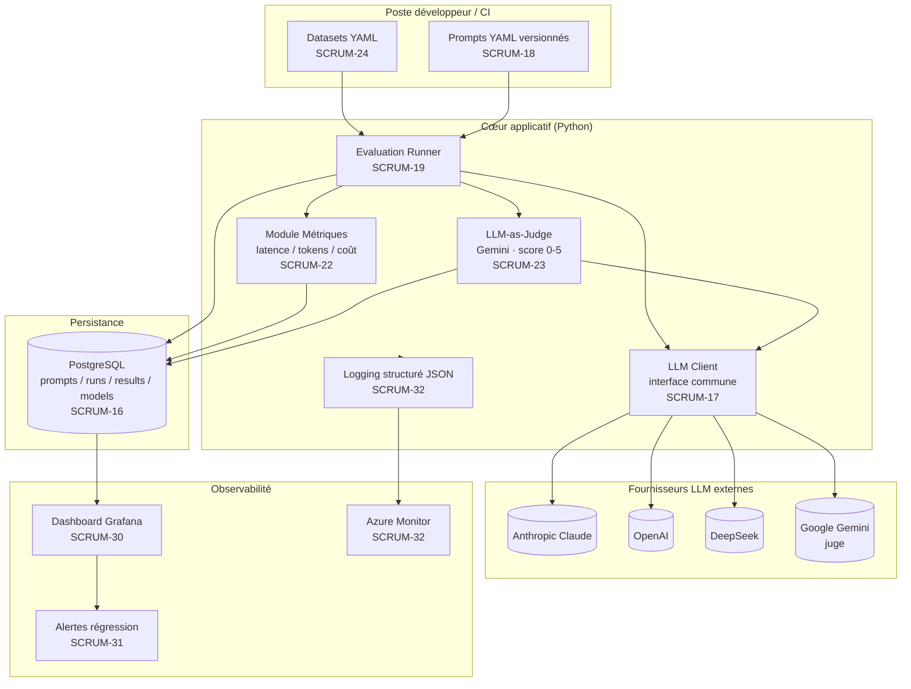
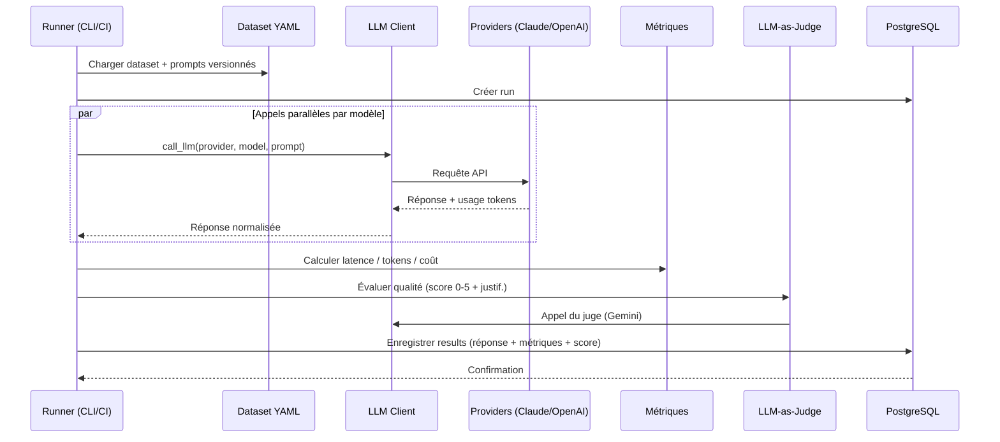
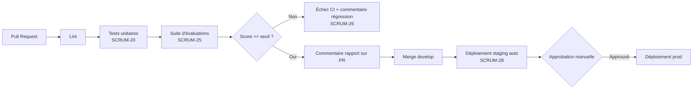

# Document d'architecture — Plateforme d'évaluation de LLM

> **Référence Jira :** SCRUM-36 — *Créer document d'architecture basé sur le backlog*
> **Projet :** SCRUM — *My Software Team*
> **Statut du document :** Révisé — réconcilié avec l'implémentation (sprint en cours) ; voir §11
> **Périmètre :** Architecture cible dérivée du product backlog (épics SCRUM-10 à SCRUM-13 et stories associées)

---

## 1. Objectif du document

Ce document traduit le contenu du product backlog en une vue technique structurée. Il décrit les composants de la plateforme, leurs responsabilités, leurs interactions et les choix techniques retenus, avec leur justification. Il sert de référence partagée pour aligner l'équipe avant le développement et de base aux décisions techniques.

Chaque section est traçable vers les items du backlog ; la matrice de traçabilité complète se trouve au §10.

---

## 2. Vue d'ensemble

La plateforme est un **banc d'essai automatisé pour modèles de langage (LLM)**. Elle permet d'exécuter un même prompt contre plusieurs modèles (Claude, OpenAI, DeepSeek, Gemini), de mesurer et comparer leurs performances (qualité, latence, coût), de stocker l'historique complet des exécutions, et de détecter automatiquement les régressions de qualité à chaque modification de code.

Le projet suit une progression en quatre temps, reflétée par les épics :

| Épic | Thème | Finalité |
|------|-------|----------|
| SCRUM-10 | Fondations | Faire tourner le cœur du système **en local** (monorepo, base de données, client LLM) |
| SCRUM-11 | Évaluation | Construire le **moteur d'évaluation** (métriques, datasets, pipeline de régression) |
| SCRUM-12 | Infrastructure Azure | **Déployer dans le cloud** (staging + prod, CD complet) |
| SCRUM-13 | Observabilité & polish | Rendre la plateforme **observable et présentable** (Grafana, alertes, documentation) |

Principe directeur tiré du backlog : *tout doit fonctionner en local avant de passer au cloud* (SCRUM-10, SCRUM-21).

---

## 3. Synthèse des besoins (issus du backlog)

Besoins fonctionnels :

- **B1 — Abstraction multi-fournisseurs :** appeler Claude, OpenAI, DeepSeek et Gemini via une interface commune (registre de modèles + adaptateurs par fournisseur), extensible à de nouveaux modèles sans toucher au reste du code (SCRUM-17, Gemini ajouté en SCRUM-23).
- **B2 — Versioning des prompts :** tracer quelle version d'un prompt a produit quels résultats, via YAML + hash (SCRUM-18).
- **B3 — Exécution comparative :** lancer un prompt contre N modèles en parallèle et stocker chaque résultat (SCRUM-19).
- **B4 — Métriques :** mesurer latence, tokens, coût (SCRUM-22) et qualité via LLM-as-judge **(Gemini)** sur une échelle 0–5 (SCRUM-23) ; la similarité cosinus est citée au niveau épic (SCRUM-11) comme métrique de qualité complémentaire.
- **B5 — Datasets de test versionnés :** suite de cas reproductibles en YAML, chargés sans modifier le code (SCRUM-24).
- **B5b — Benchmark de styles de prompting :** comparer l'impact du style de prompt (zero-shot, few-shot, instructional, contextuel, role-based) sur la qualité, par modèle (SCRUM-37).
- **B5c — Échantillonnage répété et variance :** évaluer chaque paire (cas, modèle) N fois (`--samples`, défaut 10) pour que les scores portent une **moyenne ± écart-type** au lieu d'un tirage unique bruité ; l'alerte de régression évalue alors la moyenne sur N échantillons (vue `result_variance`). *(branche `feature/repeated-sampling-variance` ; ID Jira à lier.)*
- **B5d — Contrôle du style de réponse :** mesurer si les scores du juge sont confondus par la longueur/le formatage markdown des réponses — features de style par réponse + score ajusté par OLS, inspiré d'arena-hard-auto. *(ID Jira à lier.)*
- **B6 — Détection de régression en CI :** rejouer la suite d'évaluations sur chaque PR et bloquer si la qualité passe sous un seuil (SCRUM-25), avec rapport posté en commentaire (SCRUM-26).
- **B7 — Visualisation :** dashboard comparatif par modèle (SCRUM-30) et alertes sur régression (SCRUM-31).

Besoins non fonctionnels et opérationnels :

- **B8 — Environnement local reproductible :** `docker compose up` démarre l'ensemble (SCRUM-15).
- **B9 — Persistance analysable :** schéma relationnel `prompts / runs / results / models` (SCRUM-16).
- **B10 — Déploiement cloud reproductible :** ressources Azure via IaC (Bicep, puis Terraform en bonus) (SCRUM-27, SCRUM-29).
- **B11 — Livraison contrôlée :** CD automatique sur staging, approbation manuelle sur prod (SCRUM-28).
- **B12 — Observabilité :** logs structurés JSON exploitables dans Azure Monitor (SCRUM-32).
- **B13 — Sécurité des secrets :** clés API jamais dans le code ni les logs ; variables d'environnement et GitHub Secrets (SCRUM-17, SCRUM-21, SCRUM-25).
- **B14 — Qualité du code :** tests unitaires avec mocks, couverture ≥ 70 % (SCRUM-20).
- **B15 — Documentation :** RUNBOOK et README de niveau professionnel (SCRUM-33).

---

## 4. Vue d'ensemble de l'architecture

La plateforme est organisée en **monorepo** (SCRUM-14) regroupant les domaines applicatif, évaluation, visualisation et infrastructure. Les composants logiques sont les suivants :

---

## 5. Composants principaux et responsabilités

### 5.1 LLM Client (`llm_client.py`) — SCRUM-17
Point d'entrée unique vers les fournisseurs. Expose `call_llm(provider, model, prompt)` et masque les différences entre Claude, OpenAI, DeepSeek et Gemini. Repose sur un **registre de modèles** (`MODEL_REGISTRY`) et un **adaptateur par fournisseur** (Anthropic, OpenAI, DeepSeek, Gemini) ; ajouter un modèle = ajouter une entrée au registre. Lit les clés API exclusivement depuis l'environnement. Le budget de tokens de sortie est partagé par tous les adaptateurs (`DEFAULT_MAX_TOKENS = 8192`) : sur les modèles de raisonnement (API *Responses* d'OpenAI, ex. `gpt-5`/`o3`) ce budget couvre **à la fois le raisonnement et la réponse visible** — trop bas, le raisonnement le consomme entièrement et la réponse revient vide. L'adaptateur Anthropic relève `max_retries` à 8 : le pool Sonnet renvoie des HTTP 529 (`overloaded_error`) en période de charge, et le SDK rejoue ces 529 avec back-off exponentiel pour ne pas perdre de cas.

### 5.2 Prompt Registry — SCRUM-18
Gère les prompts comme des artefacts versionnés : fichiers YAML avec champ `version`, hash dérivé du contenu, et historique consultable en base. Toute modification de contenu génère une nouvelle version, garantissant la traçabilité « quel prompt a produit quel résultat ».

### 5.3 Dataset Manager — SCRUM-24
Charge les datasets de test (YAML : nom, description, cas de test avec réponses attendues). Conçu pour qu'un nouveau dataset s'ajoute sans modifier le code. Constitue la base de tests reproductible et le socle des tests de régression.

### 5.4 Evaluation Runner (`runner.py`) — SCRUM-19
Orchestrateur principal. Prend un dataset et une liste de modèles, parallélise les appels via le LLM Client, déclenche le calcul des métriques et le scoring qualité, puis persiste chaque résultat. Exécutable en CLI : `python runner.py --dataset test.yaml`.

### 5.5 Module Métriques — SCRUM-22
Calcule pour chaque appel : latence (ms), tokens (entrée + sortie), coût estimé selon les tarifs publics du fournisseur. Ces valeurs sont attachées à chaque enregistrement de résultat.

### 5.6 LLM-as-Judge — SCRUM-23
Métrique de qualité automatisée : **Gemini** (par défaut `gemini-2.5-pro`) évalue les réponses des autres modèles et retourne un **score brut dans [0,1] + une justification courte** en JSON strict. Le score est **mis à l'échelle ×5** au moment de la persistance et stocké sur **0–5** dans `results.judge_score` (seuil d'alerte de régression à 3,5/5). Le prompt du juge (rubrique) est lui-même versionné (cf. 5.2). Le scoring est **best-effort** : un échec du juge (verdict mal formé, quota API) est journalisé et laisse `judge_score` à NULL sans interrompre le run ni perdre la réponse. *Métrique complémentaire prévue au niveau épic (SCRUM-11) : similarité cosinus entre réponse produite et réponse attendue.*

### 5.6b Benchmark de styles de prompting — SCRUM-37
Dataset séparé (`prompt_style_benchmark.yaml`) regroupant une même tâche de base déclinée en plusieurs styles (zero-shot, few-shot, instructional, contextuel, role-based). Le runner persiste le style de chaque réponse (colonne `results.prompt_style`) afin d'agréger la qualité (score juge) **par style et par modèle**. `regression_v2.yaml` reste inchangé — il s'agit d'un benchmark, pas d'une suite de non-régression.

### 5.6c Échantillonnage répété et variance
Les sorties LLM étant stochastiques, un seul résultat par (cas, modèle) est un tirage bruité, pas une estimation. Le runner évalue donc chaque paire `--samples N` fois (défaut `DEFAULT_SAMPLES = 10`) ; chaque tirage est persisté comme **sa propre ligne `results`**, étiquetée par `sample_idx` (migration 009 ; aucune contrainte d'unicité sur `(run_id, model_id, case_id)`). La vue `result_variance` (migration 010) expose, par (run, modèle, cas) : moyenne, écart-type d'échantillon (`STDDEV_SAMP`, NULL si < 2 échantillons), min/max du score juge, et moyennes de latence/coût. Le runner imprime un résumé « moyenne ± écart-type par modèle » et l'**alerte de régression évalue désormais la moyenne sur N échantillons** — bien moins susceptible de se déclencher sur un tirage malchanceux. `--temperature > 0` est nécessaire pour une vraie variance sur les modèles non-raisonnement ; `N=1` reproduit le comportement single-shot.

### 5.6d Contrôle du style de réponse (`style_features.py`, `style_analysis.py`)
Porté d'arena-hard-auto : on capture la **forme markdown** de chaque réponse (titres, gras, listes ordonnées/non ordonnées, blocs de code) dans des colonnes `resp_style_*` (migration 011) afin de diagnostiquer si la qualité perçue est confondue par la verbosité ou le formatage. Deux diagnostics complémentaires : la vue `style_confound` (migration 012) corrèle, par modèle, le score juge avec la longueur (`output_tokens`) et les marqueurs de style ; et `style_analysis.py` ajuste un **OLS poolé** du score sur ces covariables plus un effet fixe par modèle, puis rapporte le score de chaque modèle au profil de style **moyen global** (« score ajusté du style »). À ne pas confondre avec `prompt_style` (§5.6b), qui décrit le style du *prompt*, pas de la réponse. **Limite :** mesure associationnelle, pas un dé-biaisage causal (la longueur est confondue avec la difficulté ; le juge absolu ne peut pas différencier la difficulté comme le ferait un design pairwise). Le dataset `arena_hard_v2_subset.yaml` (sous-ensemble équilibré d'arena-hard v2.0, généré par `scripts/import_arena_hard.py`) alimente ce contrôle ; le dashboard `llm_style_control.json` en affiche les corrélations.

### 5.6e Décision du juge par profil d'usage — SCRUM-38
Couche **décision + reporting** au-dessus du lac de données : transforme toutes les mesures en une **recommandation de modèle par profil d'usage** (étudiant = qualité + coût bas ; rapide = vitesse ; économie = tokens minimaux ; `equilibre` = défaut, couvrant la « recommandation unique » du DoD original). Conception **hybride** : (1) **agrégation** déterministe par modèle (vue `model_decision_metrics`, migration 015) — tokens moyens, latence, score juge, **efficacité = score / 1000 tokens**, **% de fenêtre de contexte** (`input_tokens / models.context_window`, colonne ajoutée par 014), coût USD en **référence dérivée** ; (2) **scoring déterministe** (`app/decision_scoring.py`) : chaque profil (poids numériques versionnés dans `decision_profiles.yaml`, chargés par `app/profiles.py`) pondère les métriques min-max normalisées → un **classement reproductible** désigne le modèle retenu et la confiance (marge top1−top2) ; (3) **justification** : le juge LLM (Gemini) reçoit le classement calculé et **rédige seulement** la justification (JSON `{determinant_metrics, tradeoffs, reasoning}`) via le prompt **versionné** `final_decision.yaml` v2 (même infra YAML+hash que SCRUM-23) — le PICK ne vient pas du LLM, donc DoD #6 tenu sans dépendre de `temperature` ; (4) **persistance** dans la table `decisions` (colonnes `profile`, `weighted_scores` — migrations 016/017) ; (5) **visualisation** via le dashboard `llm_final_decision` (vues `decision_summary` et `decision_by_profile`). **Priorité aux tokens** ; USD jamais décisif (DoD #3). **Cache** clé `(input_hash, prompt_id, profile)` où `input_hash` intègre métriques **+ poids du profil** : éditer un poids régénère la décision. CLI : `python -m app.decide --profile <nom>` / `--all-profiles` (`--force` ignore le cache).

### 5.7 Persistance PostgreSQL — SCRUM-16
Stockage relationnel de l'historique complet (voir §6). Source de vérité pour l'analyse et l'alimentation de Grafana.

### 5.8 Logging structuré (`logging_setup.py`) — SCRUM-32
Tous les composants Python émettent des logs JSON **une ligne par événement** sur **stdout** : Azure Container Apps capture stdout dans Azure Monitor Log Analytics (`ContainerAppConsoleLogs_CL`) où chaque champ devient interrogeable — approche 12-factor, sans SDK ni agent. Chaque événement porte au minimum `timestamp` (ISO-8601 UTC), `level`, `logger`, `message`, plus les deux champs contextuels du DoD, `model` et `run_id`. Le contexte est **lié une seule fois** via le gestionnaire `log_context(run_id=…)` (équivalent du **MDC** de SLF4J ; implémenté sur `contextvars`, donc visible aussi dans les threads workers via la copie de contexte) puis stampé sur chaque enregistrement par un `ContextFilter` ; un `extra=` par appel a priorité (p. ex. `model` par tâche). Les erreurs journalisées avec `exc_info` (ou `logger.exception`) incluent la **stack trace complète** (champ `exception`). `configure_logging()` est **idempotent** et appelé par chaque point d'entrée CLI (`runner`, `decide`, `prompts.cli`, `style_analysis`). **Sécurité (B13) :** ni les clés API ni le contenu des prompts ne sont journalisés — uniquement la forme de l'appel et son issue (modèle, fournisseur, latence, tokens). Les tables de synthèse lisibles que le runner imprime en fin de course restent du `print()` (sortie de rapport CLI), distinct des événements de log.

### 5.9 Pipeline CI/CD (GitHub Actions) — SCRUM-25, SCRUM-26, SCRUM-28
Sur chaque PR : lint → tests unitaires → suite d'évaluations, avec échec si un score passe sous le seuil, et rapport comparatif posté en commentaire (régressions mises en évidence). Sur merge : déploiement automatique sur staging, approbation manuelle pour prod.

**CI implémenté (SCRUM-25) — `.github/workflows/ci.yml`.** Déclenché sur `pull_request` vers `main`, en deux jobs. (1) `lint-and-test` (hors-ligne, sans secret) : `ruff check` puis `pytest --cov=app --cov-fail-under=70` — les tests mockent les SDK LLM et `psycopg`, donc zéro appel réseau et aucune base requise. (2) `eval-gate` (`needs: lint-and-test`) : lève un service Postgres 16, applique `db/schema.sql` → migrations `db/0*.sql` → `db/seed.sql`, synchronise les prompts versionnés (`python -m app.prompts.cli sync`), puis lance le **portail de régression** — un eval *réel mais minimal* (`sprint1_smoke.yaml` × `claude-haiku-4-5` + `gpt-5`, juge Gemini, `--samples 1`) avec `--fail-under 3.5`. Les clés API proviennent de **GitHub Secrets** (`ANTHROPIC_API_KEY`, `OPENAI_API_KEY`, `GEMINI_API_KEY`) ; le job vérifie d'emblée que les trois secrets sont non vides et échoue avec une erreur explicite sinon. Le portail s'appuie sur le code `runner` : nouveau drapeau `--fail-under SCORE` + helper pur `regression_failures()` qui relit `RunOutcome.model_score_stats()` ; si un modèle a une moyenne sous le seuil, le runner sort en **code 5** (`EXIT_REGRESSION`, prioritaire sur le code 3) et le job échoue. *Limite : les secrets ne sont pas exposés aux PR issues de forks ; acceptable ici (dépôt solo).* Le rapport de régression posté en commentaire reste à faire (SCRUM-26).

### 5.10 Infrastructure as Code — SCRUM-27, SCRUM-29
Ressources Azure décrites en Bicep (ACR, Container Apps, PostgreSQL Flexible Server), recréables en une commande. Migration optionnelle vers Terraform avec state distant dans Azure Blob Storage (bonus).

### 5.11 Observabilité — SCRUM-30, SCRUM-31
Grafana est connecté à PostgreSQL et provisionné par fichiers (datasource + dashboards versionnés en JSON). Trois dashboards : **comparaison par modèle** (`llm_model_comparison.json` — latence / qualité / coût par modèle, table moyenne ± écart-type, et journal détaillé question/réponse/juge), **benchmark de styles de prompt** (`llm_style_benchmark.json` — score par style × modèle + journal détaillé), et **contrôle du style de réponse** (`llm_style_control.json` — corrélations score ↔ style et score ajusté par modèle). Un quatrième dashboard, **triage qualité** (`llm_quality_triage.json`), liste les réponses non parfaites (note < 5) avec leur cause d'échec déduite (vue `result_review`, §6), une variable de seuil de note, et les prompts les plus problématiques — pour la revue/debug plutôt que la comparaison. Un cinquième, **décision finale** (`llm_final_decision.json` — SCRUM-38), affiche le modèle recommandé + niveau de confiance, ses métriques justificatives, la justification du juge, le comparatif complet (vue `decision_summary`) et une table **recommandation par profil d'usage** (vue `decision_by_profile`). Les panels lisent les vues d'agrégation (§6). Alertes déclenchées si le score moyen descend sous 3,5/5, avec notification et résolution automatique au retour à la normale.

---

## 6. Modèle de données (SCRUM-16)

Quatre tables principales, reliées par clés étrangères :

| Table | Rôle | Relations clés |
|-------|------|----------------|
| `models` | Catalogue des modèles évalués (fournisseur, nom, tarifs) | référencée par `results` |
| `prompts` | Prompts versionnés (version, hash, contenu) | référencée par `runs` |
| `runs` | Une exécution d'évaluation (dataset, horodatage, prompt utilisé) | référence `prompts` ; parent de `results` |
| `results` | Résultat par modèle pour un run (réponse, `question`, `case_id`, latence, tokens, coût, `judge_score` + `judge_reasoning`, `prompt_style`, `sample_idx`, features de style `resp_style_*`) | référence `runs` et `models` |
| `decisions` | Recommandation du juge par profil (modèle retenu, confiance, justification, `prompt_id`, `input_hash`, `profile`, `weighted_scores`, snapshot des métriques) — SCRUM-38 | référence `prompts` |

Le schéma de base est créé par un script versionné, complété par des **migrations numérotées** dans `db/` (actuellement jusqu'à `016`) : `003` (`case_id`), `004` (vue `run_metrics`, agrégat par run), `005` (`prompt_style`), `006` (vue `style_metrics`, score moyen par style × modèle), `007` (`question`), `008` (vue `model_metrics`, agrégat par modèle pour le dashboard SCRUM-30), `009` (`sample_idx`, échantillonnage répété), `010` (vue `result_variance`, moyenne/écart-type par (run, modèle, cas)), `011` (colonnes `resp_style_*`), `012` (vue `style_confound`, corrélation score ↔ style par modèle), `013` (vue `result_review`, triage qualité : chaque résultat non parfait avec un `failure_type` heuristique), `014` (colonne `models.context_window`, SCRUM-38), `015` (vue `model_decision_metrics`, agrégat décisionnel par modèle), `016` (table `decisions` + vue `decision_summary`, décision finale SCRUM-38), `017` (colonnes `decisions.profile` / `weighted_scores` + vue `decision_by_profile`, décision par profil d'usage SCRUM-38). Un script de seed insère le catalogue de modèles (dont Gemini) ; le schéma est documenté dans un README technique. **Règle : toute évolution du schéma passe par un nouveau fichier de migration, jamais par l'édition du schéma de base.** Les vues alimentent Grafana (§5.11).

---

## 7. Flux principaux

### 7.1 Flux d'évaluation (cœur du système)

### 7.2 Flux CI/CD (détection de régression et livraison)

---

## 8. Choix techniques et justifications

| Domaine | Choix | Justification (ancrée backlog) |
|---------|-------|--------------------------------|
| Langage | **Python** | Écosystème LLM/data, tests pytest, logging — cohérent avec tous les composants (SCRUM-17/19/20/22/32) |
| Persistance | **PostgreSQL** | Relationnel adapté à l'historique structuré et à l'analyse comparative ; connexion native à Grafana (SCRUM-16, SCRUM-30) |
| Conteneurisation locale | **Docker Compose** | Démarrage de l'environnement complet sans installation manuelle (SCRUM-15) |
| Versioning prompts/datasets | **YAML + hash, dans Git** | Reproductibilité et traçabilité « prompt → résultat » (SCRUM-18, SCRUM-24) |
| Abstraction modèles | **Interface `call_llm` commune** | Ajout de modèles sans impact sur le reste du code (SCRUM-17) |
| Qualité automatisée | **LLM-as-judge (Gemini)** + similarité cosinus | Métrique reproductible et automatisable, complétée par une mesure objective (SCRUM-23, SCRUM-11) |
| CI/CD | **GitHub Actions** | Évaluations et gate de qualité sur chaque PR, secrets gérés nativement (SCRUM-25/26/28) |
| Hébergement | **Azure Container Apps + ACR + PostgreSQL Flexible Server** | Déploiement conteneurisé managé, deux environnements (SCRUM-12, SCRUM-27/28) |
| IaC | **Bicep** (→ Terraform en bonus) | Environnement recréable en une commande ; Terraform pour pratiquer le standard industrie (SCRUM-27, SCRUM-29) |
| Observabilité | **Grafana + Azure Monitor** | Visualisation temps réel et logs centralisés (SCRUM-30/31/32) |

---

## 9. Environnements, déploiement et sécurité

**Environnements :** local (Docker Compose) → staging (déploiement auto) → prod (approbation manuelle). Le déploiement complet vise moins de 10 minutes (SCRUM-28).

**Sécurité des secrets (B13) :** les clés API ne figurent jamais dans le code ni les logs. En local elles proviennent de variables d'environnement (`.env`, avec `.env.example` documenté) ; en CI/CD elles sont injectées via GitHub Secrets. Le flux end-to-end inclut une vérification explicite d'absence de clé dans les logs (SCRUM-21).

**Qualité (B14) :** tests pytest avec appels API mockés (aucun coût réel), couverture ≥ 70 %, exécutés dans la CI avant les évaluations (SCRUM-20).

---

## 10. Matrice de traçabilité backlog → architecture

| Item backlog | Élément(s) d'architecture |
|--------------|---------------------------|
| SCRUM-14 Monorepo | Organisation du dépôt (§4) : `app/ evaluator/ dashboard/ infra/ .github/workflows/` |
| SCRUM-15 Docker Compose | Environnement local (§9) |
| SCRUM-16 Schéma PostgreSQL | Persistance (§5.7) + Modèle de données (§6) |
| SCRUM-17 LLM Client | LLM Client (§5.1) |
| SCRUM-18 Versioning prompts | Prompt Registry (§5.2) |
| SCRUM-19 Runner | Evaluation Runner (§5.4) + Flux §7.1 |
| SCRUM-20 Tests pytest | Qualité (§9) |
| SCRUM-21 Flux e2e local | Flux d'évaluation (§7.1) + sécurité secrets (§9) |
| SCRUM-22 Métriques | Module Métriques (§5.5) |
| SCRUM-23 LLM-as-judge | LLM-as-Judge (§5.6) |
| SCRUM-24 Datasets | Dataset Manager (§5.3) |
| SCRUM-25 CI évaluations | Pipeline CI/CD (§5.9) + Flux §7.2 |
| SCRUM-26 Rapport régression PR | Pipeline CI/CD (§5.9) |
| SCRUM-27 Bicep Azure | IaC (§5.10) |
| SCRUM-28 CD staging/prod | Pipeline CI/CD (§5.9) + Environnements (§9) |
| SCRUM-29 Terraform (bonus) | IaC (§5.10) |
| SCRUM-30 Dashboard Grafana | Observabilité (§5.11) |
| SCRUM-31 Alertes Grafana | Observabilité (§5.11) |
| SCRUM-32 Logging JSON | Logging structuré (§5.8) |
| SCRUM-33 RUNBOOK/README | Référence ce document pour la partie « architecture overview » |
| SCRUM-34 Démo & review | Livrable final illustrant les flux §7 |
| SCRUM-37 Benchmark styles de prompting | Benchmark de styles (§5.6b) + colonne `results.prompt_style` (§6) |
| SCRUM-38 Décision du juge par profil | Décision par profil (§5.6e) + colonne `models.context_window`, vue `model_decision_metrics`, table `decisions` + vues `decision_summary` / `decision_by_profile`, profils versionnés `decision_profiles.yaml` (§6) + dashboard `llm_final_decision` (§5.11) |
| *Échantillonnage répété & variance* (branche `feature/repeated-sampling-variance` ; ID Jira à lier) | Échantillonnage répété (§5.6c) + `sample_idx` / vue `result_variance` (§6) |
| *Contrôle du style de réponse* (ID Jira à lier) | Contrôle du style (§5.6d) + colonnes `resp_style_*` / vue `style_confound` (§6) |

---

## 11. Hypothèses et points ouverts (à valider en revue)

1. La **similarité cosinus** (citée dans l'épic SCRUM-11) n'a pas de story dédiée — à confirmer : métrique distincte ou regroupée avec un autre item ? *(Non encore implémentée.)*
1b. **Modèle juge — décision actée :** le juge est **Gemini** (et non Claude comme envisagé initialement) ; SCRUM-23 a été mis à jour en conséquence. Le suivi du coût du juge séparément a été retiré du périmètre de SCRUM-23.
2. Les **tarifs des modèles** sont supposés stockés/maintenus côté table `models` ; le mode de mise à jour reste à préciser.
3. Le **modèle de branches** (SCRUM-14, develop → staging) est supposé GitFlow simplifié — à confirmer.
4. Le **canal de notification des alertes** (email vs webhook, SCRUM-31) reste à arrêter.
5. Les travaux **échantillonnage répété / variance** et **contrôle du style de réponse** (branche `feature/repeated-sampling-variance`) sont implémentés mais leurs **IDs de stories Jira restent à lier** dans la matrice (§10).

> **Note de statut :** ce document est versionné dans `docs/ARCHITECTURE.md` (DoD SCRUM-36) et a été **réconcilié avec l'implémentation** (juge Gemini, fournisseurs DeepSeek/Gemini, échelle 0–5, colonnes `question`/`case_id`/`prompt_style`/`sample_idx`/`resp_style_*`, benchmark SCRUM-37, échantillonnage répété + variance, contrôle du style de réponse, triage qualité ; migrations jusqu'à `013`). Les sections Azure/IaC (§5.10) et Observabilité Grafana (§5.11, alertes) décrivent l'**architecture cible** : stories planifiées (SCRUM-27 à 31) non encore implémentées. Sont **implémentés** : le **logging structuré JSON** (§5.8, SCRUM-32 — `app/logging_setup.py`, câblé dans tous les points d'entrée CLI) et le **pipeline CI** (§5.9, SCRUM-25 — `.github/workflows/ci.yml` : lint ruff → tests pytest + couverture ≥ 70 % → portail de régression d'éval qui échoue si un score moyen passe sous 3,5/5, via `runner --fail-under`). Revue par un pair restant à effectuer.
