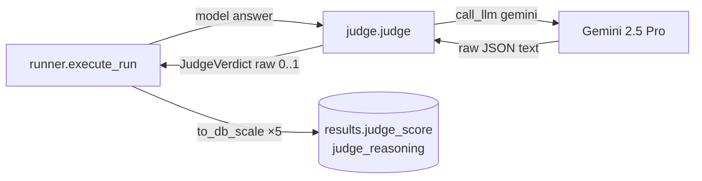
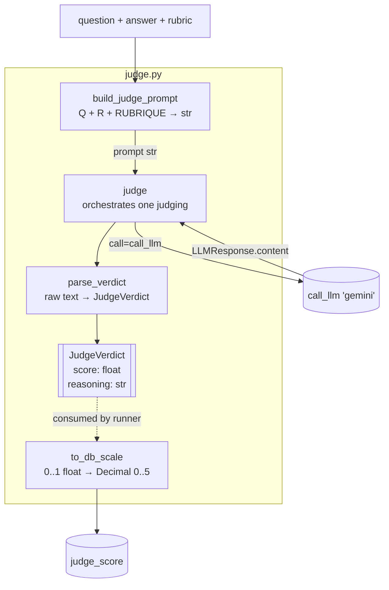
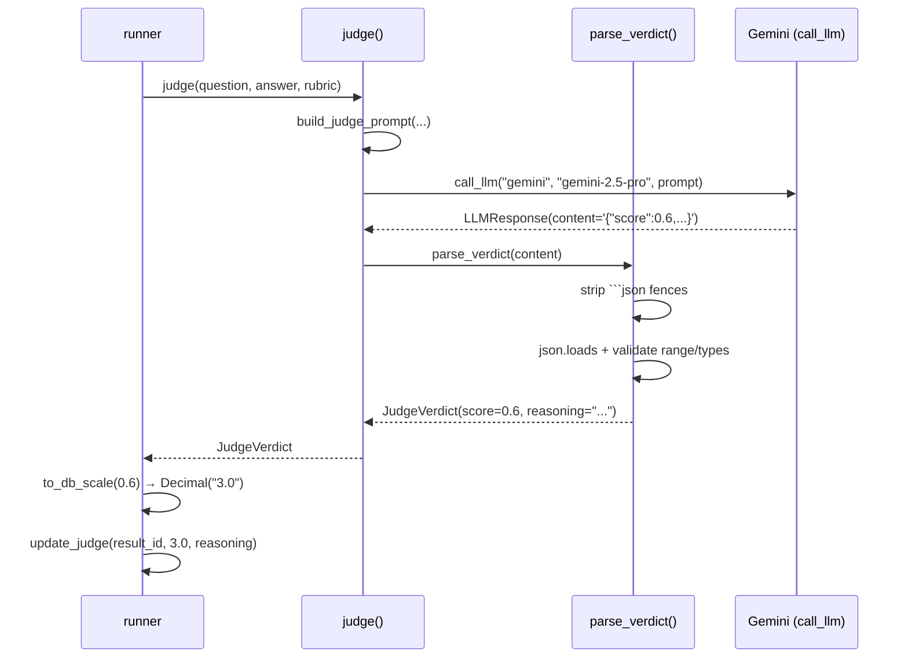
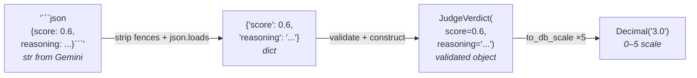
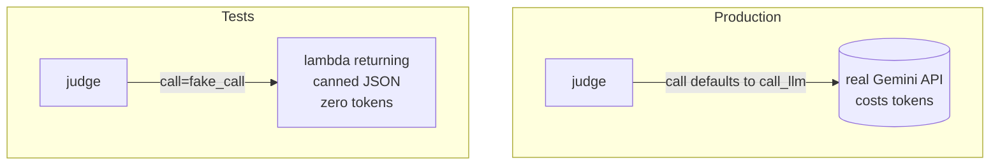
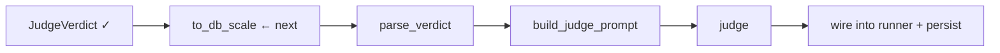

# `app/judge.py` — LLM-as-Judge Flow (SCRUM-23)

Visual map of how the judge module turns a model's answer into a persisted
score. Diagrams use Mermaid (renders in GitHub + VS Code Markdown preview).

> **Scale contract:** the judge emits a raw float in `[0.0, 1.0]`; it is
> scaled `×5` at the persistence boundary and stored on a `0–5` scale in
> `results.judge_score`. The `3.5/5` regression alert == raw `0.7`.
> (See CLAUDE.md → Database.)

---

## 1. Where the judge sits in the pipeline

The judge module owns only the middle box. The **runner** decides *when* to
judge and *how to persist*; the judge module is a pure "answer → verdict"
transform reached through the same `call_llm` seam as every provider.

---

## 2. The functions inside `judge.py` (data pipeline)

**Responsibilities, one line each:**

| Function | Input | Output | Job |
|---|---|---|---|
| `build_judge_prompt` | question, answer, rubric | `str` | Fill the rubric's Q / R / RUBRIQUE slots |
| `judge` | question, answer, rubric, `call=` | `JudgeVerdict` | Orchestrate: build → call → parse |
| `parse_verdict` | raw judge text | `JudgeVerdict` | Defensive JSON parse + validate |
| `to_db_scale` | raw score `0..1` | `Decimal` `0..5` | Scale at the persistence boundary |
| `JudgeVerdict` | — | — | Typed, frozen value object |

---

## 3. What happens in one judging call (sequence)

---

## 4. The data transformation, step by step

Each arrow is a function boundary. Untrusted text becomes a trusted object at
the `parse_verdict` step — after that, nothing downstream re-checks the shape.

---

## 5. The testing seam (why `judge` takes `call=`)

`judge(question, answer, rubric, *, call=call_llm)` — the same injection
pattern as `runner.execute_run`. Tests pass a fake `call`, so the whole
parse-and-scale path runs offline with no API spend.

---

## Build order (current status)

