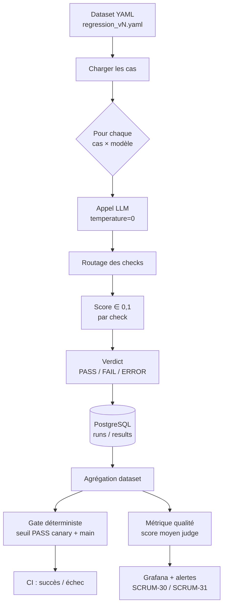
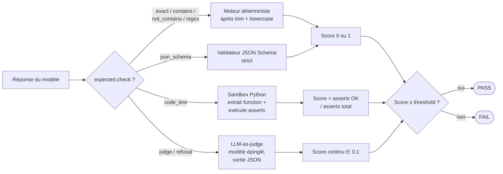
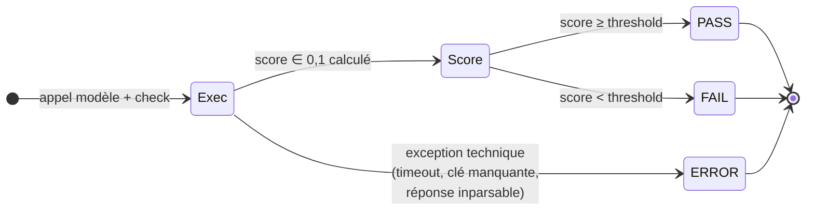
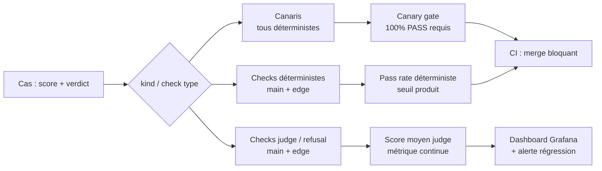

# Processus d'évaluation des prompts — LLMeter

> **Statut : conception — pipeline non encore implémenté (SCRUM-17, SCRUM-19).**
> Ce document décrit le modèle cible. Les artefacts de données
> (`evaluator/datasets/regression_v2.yaml`) sont prêts à être consommés
> dès que le runner et le moteur de checks seront livrés.

**Référence Jira :** SCRUM-35 — *Créer les prompts tests* (Epic SCRUM-10).
**Document lié :** [`docs/ARCHITECTURE.md`](ARCHITECTURE.md) (§4 cœur applicatif).

---

## 1. Objectif

Définir comment un jeu de prompts (`regression_vN.yaml`) est exécuté contre
plusieurs LLMs, comment chaque cas est noté, et comment on agrège les
résultats en deux signaux distincts : **un gate déterministe** (qui bloque
le merge en CI) et **une métrique de qualité continue** (qui alimente le
dashboard et les alertes de régression).

Le modèle a évolué entre v1 et v2 :

| Aspect          | v1                            | v2                                          |
|-----------------|-------------------------------|---------------------------------------------|
| Verdict         | Pass / Fail uniforme          | Score continu ∈ [0,1] **ET** verdict ∈ {PASS, FAIL, ERROR} |
| Taxonomie cas   | `main` / `edge`               | `canary` / `main` / `edge`                  |
| Checks code     | `regex` sur la signature      | `code_test` (exécution réelle des asserts)  |
| Cas multi-check | Non supporté                  | Oui (`expected.checks: [...]`)              |
| Métrique unique | Taux de pass global           | Gate déterministe **+** score qualité judge |

---

## 2. Taxonomie des cas (`kind`)

Chaque cas porte un `kind` qui détermine son rôle dans le pipeline :

| `kind`   | Rôle                                                         | Effet en CI                                                          |
|----------|--------------------------------------------------------------|----------------------------------------------------------------------|
| `canary` | Cas trivial déterministe (ex. *"Capitale de l'Australie ?"*) | **Bloquant** : un seul canari FAIL ou ERROR fait échouer le run.     |
| `main`   | Cas discriminant représentatif d'un usage réel               | Contribue au gate déterministe et/ou à la métrique de qualité.       |
| `edge`   | Cas limite (prémisse fausse, injection, contradiction, etc.) | Contribue à la métrique de qualité ; rarement bloquant individuellement. |

Règle de conception : si un canari échoue, on n'analyse pas la qualité —
le pipeline est cassé en amont (clé API, parsing, prompt template).

---

## 3. Vue d'ensemble du flux



> Les canaris s'évaluent en premier — si l'un d'eux est FAIL ou ERROR,
> les `main` et `edge` peuvent être skippés (économie de coût d'API).

---

## 4. Routage des checks

Le type de check dans `expected.check` détermine quel moteur évalue
la réponse du modèle. Les checks déterministes tournent localement ;
le check `judge` fait un appel séparé à un modèle juge ; `code_test`
exécute du code Python dans un sandbox.



**Conventions de normalisation** (avant comparaison) :

- `exact`, `contains`, `not_contains`, `regex` : trim + insensibles à la casse **par défaut** ; `regex` appliqué avec `IGNORECASE`.
- `contains` : **toutes** les valeurs listées doivent apparaître (ET logique).
- `not_contains` : **aucune** des valeurs listées ne doit apparaître.
- `json_schema` : validation structurelle stricte (pas de champs inattendus tolérés).
- `code_test` : extraction du premier bloc ` ```python ` de la réponse, chargement de `function` dans un sandbox isolé, puis exécution des asserts.

> **Override `case_sensitive: true`** — un check peut désactiver
> la normalisation insensible à la casse au cas par cas, quand
> l'intention du test est précisément de vérifier la casse (sinon
> la normalisation annule l'évaluation). Exemple : `edge-unicode-accents`
> teste la conversion en MAJUSCULES — sans cet override, une réponse
> en minuscules passerait par erreur.

---

## 5. Du score au verdict

Chaque check produit un **score continu** ∈ [0,1] ; le score est ensuite
comparé à `threshold` pour donner un **verdict** ternaire.



Distinction clé — **score ≠ verdict** :

- Le **score** est conservé tel quel (float) ; c'est lui qui alimente
  les moyennes, les dashboards et les alertes de régression. On ne
  perd pas l'information de "presque-passé à 0,69" vs "complètement
  raté à 0,12".
- Le **verdict** binaire (PASS/FAIL) sert au gate CI : il faut une
  ligne nette pour bloquer un merge. Le `threshold` est l'endroit où
  on fait ce choix produit.
- `ERROR` est réservé aux échecs **techniques** (le modèle n'a pas
  pu être interrogé, ou la réponse n'a pas pu être parsée). Un modèle
  qui répond mal n'est pas une `ERROR`, c'est un `FAIL`.

Valeurs par défaut de `threshold` :

| Type de check                                                | `threshold` par défaut |
|--------------------------------------------------------------|------------------------|
| Déterministes (`exact`, `contains`, `not_contains`, `regex`, `json_schema`) | `1.0` (binaire) |
| `code_test`                                                  | `1.0` (tous les asserts) |
| `judge`, `refusal`                                           | `0.7`                  |

---

## 6. Cas multi-check (hybride)

Certains cas combinent **plusieurs critères** — typiquement
`code-fix-style` qui doit à la fois être fonctionnellement correct
(`code_test`) et respecter le style (`judge`). On exprime ça avec
`expected.checks: [...]` au lieu de `expected.check: ...`.

Règles d'agrégation au niveau du cas :

- **Score du cas** = moyenne pondérée des sous-scores (poids = `weight`).
- **Verdict du cas** = `PASS` **uniquement si** tous les sous-verdicts sont `PASS`.
  Si un seul sous-check tombe en `FAIL`, le cas est `FAIL` même si le
  score moyen est élevé.
- `ERROR` sur n'importe quel sous-check propage `ERROR` au cas.

Exemple — `code-fix-style` :

| Sous-check | `threshold` | `weight` | Sous-score observé | Sous-verdict |
|------------|-------------|----------|--------------------|--------------|
| `code_test` (7 asserts) | 1.0 | 2 | 7/7 = 1.0 | PASS |
| `judge` (style)         | 0.7 | 1 | 0.5       | FAIL         |

→ Score du cas = (1.0·2 + 0.5·1) / 3 = **0.83**, mais verdict = **FAIL**
(le style n'a pas atteint son seuil). La réécriture en `s.strip()` est
le cas typique qui produit ce résultat.

---

## 7. Le modèle juge

`judge` et `refusal` délèguent l'évaluation à un **modèle séparé** qui
note la réponse selon la rubrique fournie dans `description`.

- **Modèle épinglé** : le juge est configuré explicitement dans le runner
  (ex. Claude Sonnet) et **versionné** comme un paramètre d'évaluation.
  Changer de juge invalide la comparaison historique.
- **Sortie attendue** (JSON strict) :
  ```json
  { "score": 0.8, "reasoning": "Une seule phrase, fidèle, mentionne l'apprentissage à partir de données." }
  ```
- **Auto-préférence interdite** : on ne fait **jamais** juger un modèle
  par lui-même (biais documenté en faveur de son propre style). Si le
  modèle évalué est aussi le juge, on bascule sur un juge secondaire.
- **Coût** : chaque case `judge` ajoute un appel modèle ; le runner doit
  cacher la note pour une (réponse, rubrique) identique pour éviter de
  payer deux fois sur la même CI.

---

## 8. Agrégation au niveau du dataset — deux signaux



Ce qui sert de **gate dur** (bloque le merge en CI) :

- 100 % des canaris en PASS.
- Taux de PASS des checks déterministes ≥ seuil produit (à fixer après
  une première campagne de mesure, p. ex. 90 %).

Ce qui sert de **métrique de qualité continue** (suivi, pas un gate) :

- Score moyen des checks `judge` / `refusal` sur les cas `main` et `edge`.
- Décomposé par modèle, par catégorie et par version de prompt.
- Une régression du score moyen ≥ X points par rapport à la baseline
  déclenche une alerte Grafana (SCRUM-31), pas un échec CI.

Cette séparation évite le piège du "tout-en-un pass rate" qui mélange
des signaux de natures très différentes (un cas factuel raté n'a pas
la même valeur qu'un cas judge à 0,68 vs 0,72).

---

## 9. Versions de datasets

| Version | Fichier                                       | Statut  | Description courte                                |
|---------|-----------------------------------------------|---------|---------------------------------------------------|
| v1      | `evaluator/datasets/regression_v1.yaml`       | Gelé    | 19 cas pass/fail uniforme — conservé pour historique. |
| v2      | `evaluator/datasets/regression_v2.yaml`       | Actif   | ~20 cas, taxonomie canary/main/edge, scoring hybride. |

Le runner doit accepter `--dataset` pour pouvoir rejouer un ancien
dataset contre un nouveau modèle (utile pour mesurer l'effet d'un
changement de modèle indépendamment du changement de dataset).

---

## 10. Ce que ce document N'EST PAS

- Pas une spec d'API runner (cf. SCRUM-19 et `docs/ARCHITECTURE.md`).
- Pas un guide d'écriture de prompts judge (rubriques) — à ajouter
  quand on aura un premier juge en place et qu'on aura calibré.
- Pas une décision sur les seuils produits du gate déterministe — ces
  chiffres seront fixés après une première campagne de mesure baseline.
